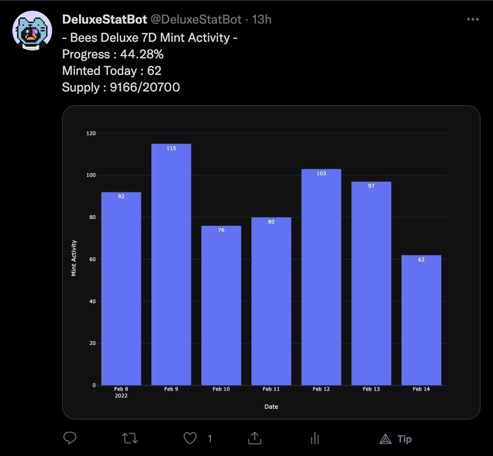
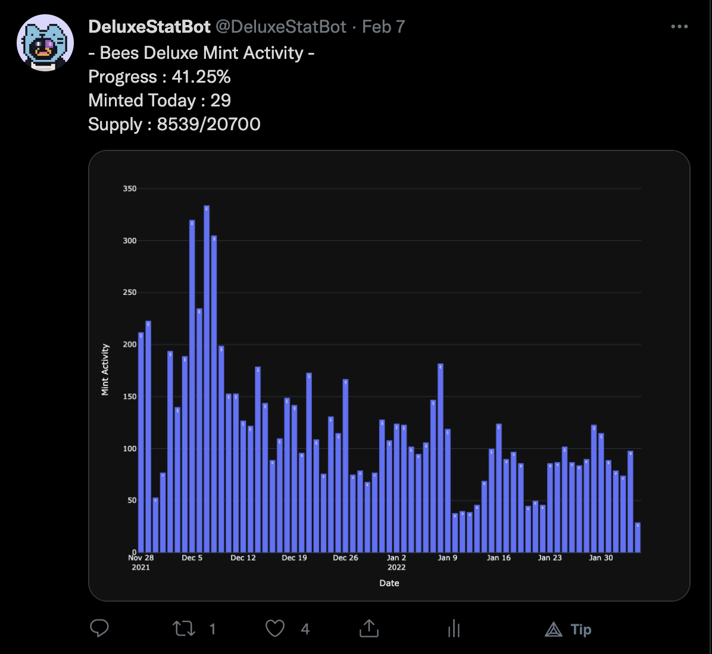
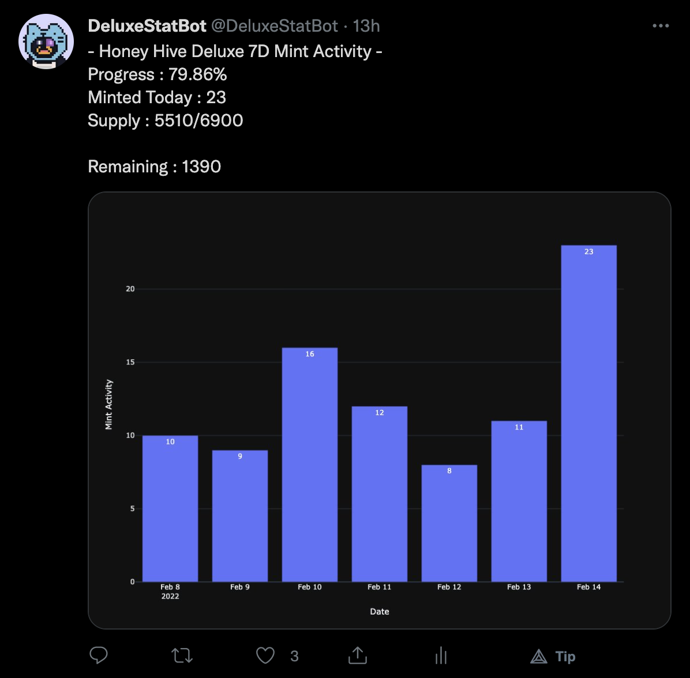
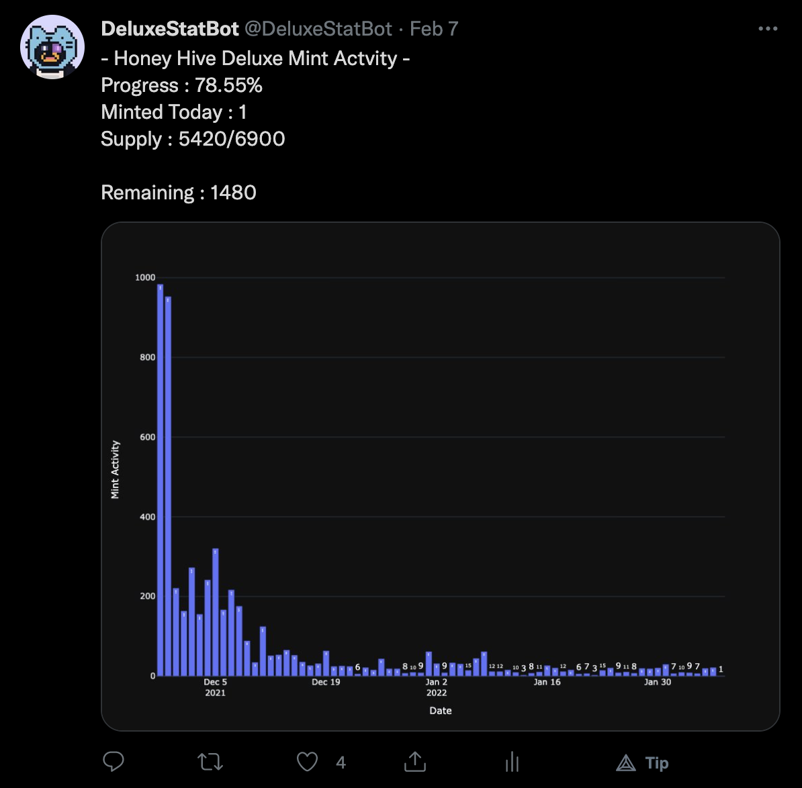
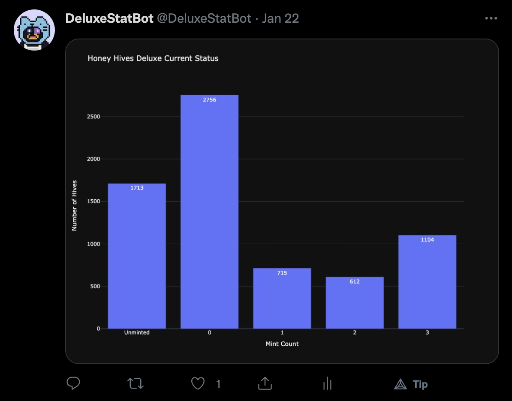

# deluxe_stat_bot_py

https://twitter.com/DeluxeStatBot  

The OG design for the DeluxeStatBot, written in python.   

Included features:  
- Bears Deluxe Migration Progress  
- Bees Deluxe 7D Mint Activity  
- Bees Deluxe Historical Mint Activity  
- Honey Hive Deluxe 7D Mint Activity  
- Honey Hive Deluxe Historical Mint Activity  
- Honey Hive Deluxe Current Hive Status   

**Discontinued. PROD will be refactored to rust. 

## Configuration

- Set absolute paths for bin, etc, log, work  
- ES_KEY => etherscan api key  
- CONSUMER_KEY, CONSUMER_SECRET, ACCESS_TOKEN, ACCESS_SECRET => twitter api pre-generated v1.1 access   
- ALCHEMY_API_URL => alchemy api key  

## Usage 

./deluxe_stat_bot.py -c [config_path] -i [cmd] -a [contract_addr]  

cmd = 0, mint progress, supported=[bears,bees,hives] 
cmd = 1, status, supported=[hives] 

## Output

Bears Deluxe Migration Progress  
-> ./deluxe_stat_bot.py -c /Users/daemon1/Dev/dev14/etc/config.xml -i 0 -a 0x4BB33f6E69fd62cf3abbcC6F1F43b94A5D572C2B   

     

Bees Deluxe 7D Mint Activity  
-> ./deluxe_stat_bot.py -c /Users/daemon1/Dev/dev14/etc/config.xml -i 0 -a 0x1c2CD50f9Efb463bDd2ec9E36772c14A8D1658B3 -t 0  
OR  
-> ./deluxe_stat_bot.py -c /Users/daemon1/Dev/dev14/etc/config.xml -i 0 -a 0x1c2CD50f9Efb463bDd2ec9E36772c14A8D1658B3   
** -t option is not required because the default setting for this command is 7D.   

     

Bees Deluxe Historical Mint Activity  
-> ./deluxe_stat_bot.py -c /Users/daemon1/Dev/dev14/etc/config.xml -i 0 -a 0x1c2CD50f9Efb463bDd2ec9E36772c14A8D1658B3 -t 1   

     

Honey Hive Deluxe 7D Mint Activity  
-> ./deluxe_stat_bot.py -c /Users/daemon1/Dev/dev14/etc/config.xml -i 0 -a 0x5df89cC648a6bd179bB4Db68C7CBf8533e8d796e -t 0  
OR  
-> ./deluxe_stat_bot.py -c /Users/daemon1/Dev/dev14/etc/config.xml -i 0 -a 0x5df89cC648a6bd179bB4Db68C7CBf8533e8d796e   

     

Honey Hive Deluxe Historical Mint Activity  
-> ./deluxe_stat_bot.py -c /Users/daemon1/Dev/dev14/etc/config.xml -i 0 -a 0x5df89cC648a6bd179bB4Db68C7CBf8533e8d796e -t 1   

     

Honey Hive Current Status  
-> ./deluxe_stat_bot.py -c /Users/daemon1/Dev/dev14/etc/config.xml -i 1 -a 0x5df89cC648a6bd179bB4Db68C7CBf8533e8d796e   

     

